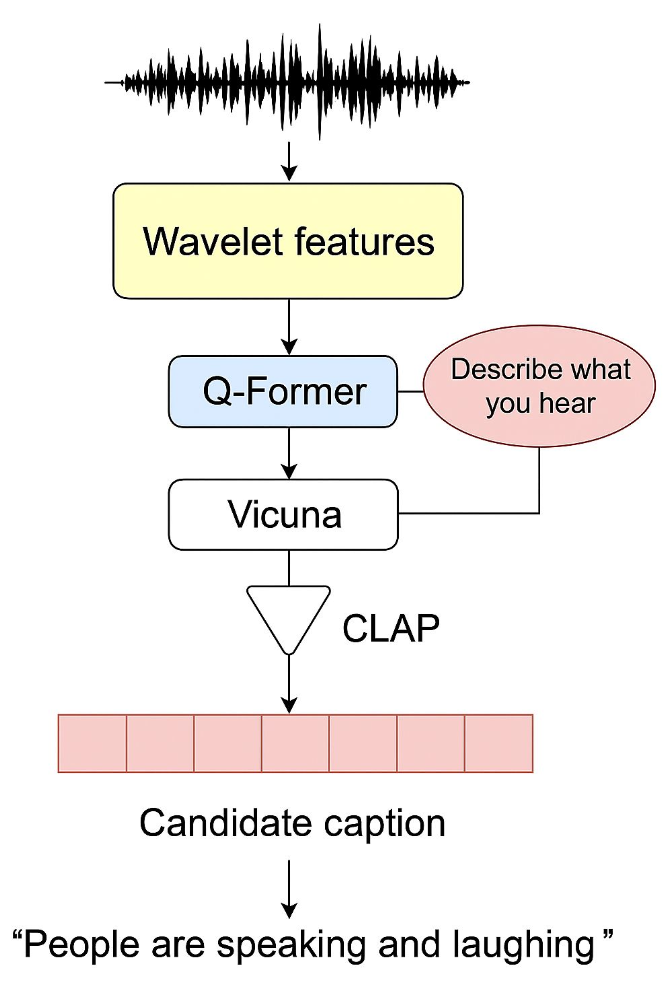

# LLM-AAC

**Team Members: Nika Emami, Chuyang Chen, Chenqian Le**

This is a repository for the LLM Automated Audio Captioning project.

Automated Audio Captioning (AAC) involves generating descriptive textual captions from audio inputs.

# Basic Pipeline

- Audio --> Audio Feature --> Projector--> LLM (Vicuna) --> Caption --> CLAP --> Score --> Final Caption

  

# Dataset
- **Clotho v2:** a curated audio dataset designed for audio captioning tasks.
  
  4981 audio clips, 15-30s each, 44.1 kHz, mono
  
  5 captions per audio file, 8-20 word length

## Feature Pre-computation
Pre-computing CWT features significantly speeds up training, saved to h5 file with `generate_h5.py` and `generate_h5_eval.py` .

- Input: Raw waveform

- Transform: Morlet wavelet, 128 log-spaced scales

- Output: Time-frequency matrix of wavelet coefficients

## Training with Pre-computed Features
Bash files are saved in `/gpfs/scratch/cl6707/Projects/LLM-AAC/LLM-AAC/SLAM-LLM/examples/slam_aac/scripts`

For example, `finetune_clotho_qformer_cwt.sh` is for finetuning the Q-former with pre-computed CWT features.

The script will:
1. Run Q-former projector training and LLM finetuning
2. Save checkpoints to `exps`

## Evaluation

Evaluation is done with `compute_metrics.py`

## Results
Blank predictions are excluded from metric computation:

| Method | METEOR | CIDEr | SPIDEr | SPIDEr-FL | FENSE |
|--------|---------|--------|---------|------------|--------|
| CWT + MLP | 24.54 | 29.87 | 14.94 | 14.93 | 20.58 |
| Mel Spec + MLP | 13.94 | 19.77 | 9.88 | 9.87 | 11.43 |
| CWT + Q-former | 26.88 | 30.77 | 15.38 | 15.02 | 22.47 |

## Conclusion

- The CWT + Q-Former setup shows the strongest results when the model generates valid captions.

- Mel-Spectrogram + MLP performs the worst, highlighting the limits of shallow projections.

- Q-Former struggles when outputs include blanks or decoding errors — it’s more sensitive to failure cases.

- CWT features are expressive, but can be noisy or overly compressed after pooling.

- The Mel + MLP combo is simpler, but more stable across all samples.

